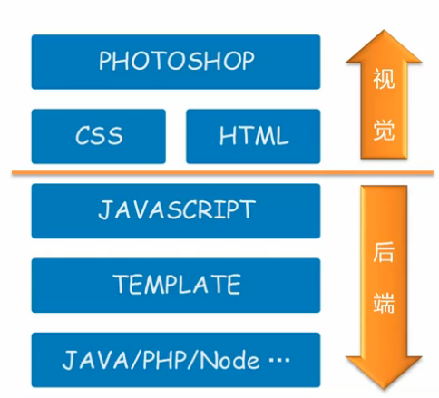
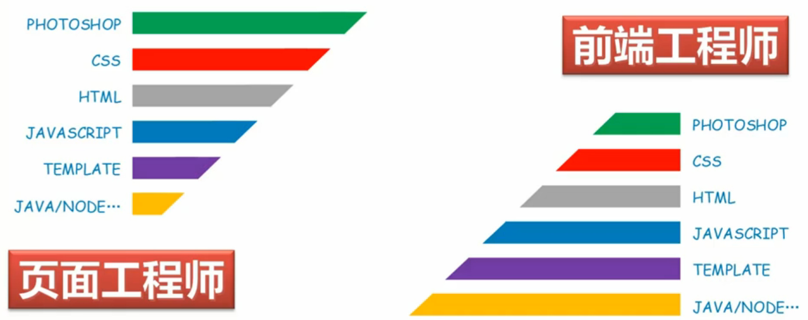
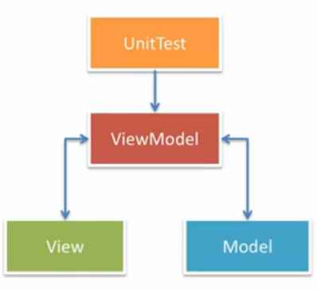

## 技术栈

### 全览



- Photoshop，获取图片资源
- CSS 与 HTML，制作页面
- JavaScript 前端交互逻辑
- Template 结构与内容分离整合
- Java/PHP/Node 后端逻辑

**弊端：**

- 后期维护性差（相同内容，不同形成存在）
- 专业化程度低
- 需求响应速度慢


### 前端工程师新责任


随着视图层也会存在业务逻辑的需求，前端工程师也会参与到业务逻辑的实现中去。 这样使前端工程师可以在后期转换成全栈工程师（Fullstack Developer)。

### 角色定义

完成一个 Web 系统需要至少以下三种角色：

- 视觉工程师，视觉稿到交互原型的转化
- 前端工程师，实现系统前端交互逻辑
- 后端工程师，系统后端业务逻辑

#### 前端工程师



前端部分又可再细分为页面工程师和前端工程师**。前者更注重和视觉工程师的协作， 后者则更多的与后端工程师进行协作。

**页面工程师**

- 精通切图技术 （Photoshop，Sketch）
- 精通页面制作 （CSS，HTML）
- 熟悉前端开发技术 （JavaScript，Template）
- 了解后端开发技术 （Java，Node）

**前端工程师**

- 精通页面制作 （CSS，HTML）
- 精通前端开发技术 （JavaScript，Template）
- 熟悉切图技术 （Photoshop，Sketch）
- 熟悉后端开发技术 （Java，Node）

**全栈工程师**

- 全精通

## DOM

### 文档树

Document Object Model (DOM) 为文档对象模型， 它使用对象的表示方式来表示对应的文档结构及其中的内容。

DOM（文档对象模型）是针对HTML和XML文档的一个API，通过DOM可以去改变文档。

这个说法很官方，大家肯定还是不明白。

举个例子：我们有一段HTML，那么如何访问第二层第一个节点呢，如何把最后一个节点移动到第一个节点上面去呢？

DOM就是定义了如果做类似操作，那么应该怎么做的标准。比如用getElementById来访问节点，用insertBefore来插入节点。

当浏览器载入HTML时，会生成相应的DOM树。

**DOM 包含**

- DOM Core
- DOM HTML
- DOM Style
- DOM Event

### HTML 转换 DOM 树

```html
<!DOCTYPE html>
<html lang="en">
  <head>
    <title>My title</title>
  </head>
  <body>
    <a href="">My Link</a>
    <h1>My header</h1>
  </body>
</html>
```


## 框架

库（Library）、框架（Framework）的区别


- 库 为针对特定问题的解答具有专业性，不控制应用的流程且被动调用。
- 框架 具有控制翻转，决定应用的生命周期，于是便集成了大量的库。

## 解决方案

- DOM
- Communication（通讯）
- Utility（增强）
- Templating（模板）
- Component（组件）
- Routing（路由）
- Architecture（解耦）

### DOM

与其相关的有 `Selector`（选择器）、`Manipulation`（DOM操作）、`Event`（DOM事件）、`Animation`（动画）。 它的主要职责则为为下面的这些：

- 提供便利的 DOM 查询、操作、移动等操作
- 提供事件绑定及事件代理支持
- 提供浏览器特性检测及 UserAgent 侦测
- 提供节点属性、样式、类名的操作
- 保证目标平台的跨浏览器支持

常用的 DOM 库有 jQuery（使用链式接口），zepto.JS，MOOTOO.JS（使用原生 DOM 对象，通过直接跨站了 DOM 原生对象）。

**基础领域**

<table>
<thead>
<tr>
<th>库名</th>
<th>大小</th>
<th>兼容性</th>
<th>优点</th>
<th>缺点</th>
</tr>
</thead>
<tbody>
<tr>
<td>MOOTOO.JS</td>
<td>96KB</td>
<td>IE6+</td>
<td>概念清晰、无包装对象、接口设计优秀、源码清晰易懂、不局限于 DOM 与 AJAX</td>
<td>扩展原生对象（致命）、社区衰弱</td>
</tr>
<tr>
<td>jQuery</td>
<td>94KB</td>
<td>IE6+</td>
<td>社区强大普及率高、包装对象、专注于 DOM</td>
<td>包装对象（容易混淆）</td>
</tr>
<tr>
<td>zepto.JS</td>
<td>25KB</td>
<td>IE10+</td>
<td>小且启动快、接口与 jQuery 兼容、提供简单手势操作</td>
<td>无法与 jQuery 100% 对于、支持浏览器少、功能弱</td>
</tr>
</tbody>
</table>

**专业领域**

<table>
<thead>
<tr>
<th>领域</th>
<th>库名</th>
<th>大小</th>
<th>描述</th>
</tr>
</thead>
<tbody>
<tr>
<td>手势</td>
<td>Hammer.JS</td>
<td>12KB</td>
<td>常见手势封装（Tab、Hold、Transform、Swifp）并支持自定义</td>
</tr>
<tr>
<td>高级动画</td>
<td>Velocity.JS</td>
<td>12KB</td>
<td>复杂动画序列实现，不仅局限于 DOM</td>
</tr>
<tr>
<td>视频播放</td>
<td>Video.JS</td>
<td>101KB</td>
<td>类似原生 video 标签的使用方式，对低级浏览器使用 flash 播放器</td>
</tr>
<tr>
<td>局部滚动</td>
<td>isscroll.JS</td>
<td>13KB</td>
<td>移动端<code>position:fix</code> + <code>overflow:scroll</code>的救星</td>
</tr>
</tbody>
</table>

### Communication（通讯）

与其相关的有 `XMLHttpRequest`、`Form`、`JSONP`、`Socket`。 它的主要职责则为为下面的这些：

- 处理与服务器的请求与相应
- 预处理请求数据与响应数据 Error/Success 的判断封装
- 多类型请求，统一接口（XMLHttpRequest1/2、JSONP、iFrame）
-  处理浏览器兼容性

<table>
<thead>
<tr>
<th>库名</th>
<th>大小</th>
<th>支持</th>
</tr>
</thead>
<tbody>
<tr>
<td>Reqwest</td>
<td>3.4KB</td>
<td>JSONP支持、稳定 IE6+支持、CORS 跨域、Promise/A 支持</td>
</tr>
<tr>
<td>qwest</td>
<td>2.5KB</td>
<td>代码少、支持XMLHttpRequest2、CORS 跨域、支持高级数据类型（ArrayBuffer、Blob、FormData）</td>
</tr>
</tbody>
</table>

**实时性要求高的需求**

<table>
<thead>
<tr>
<th>库名</th>
<th>支持</th>
</tr>
</thead>
<tbody>
<tr>
<td>socket.io</td>
<td>实时性、支持二进制数据流、智能自动回退支持、支持多种后端语言（NodeJS 最为稳妥）</td>
</tr>
</tbody>
</table>

### Utility（增强）

与其相关的有 函数增强 & `Shim`（保证实现与规范一致）、`Flow Control`。 它的主要职责则为为下面的这些：

- 提供 JavaScript 原生不提供的功能
- 方法门面包装使其便于使用
- 异步列队及流程控制

<table>
<thead>
<tr>
<th>库名</th>
<th>大小</th>
<th>描述</th>
</tr>
</thead>
<tbody>
<tr>
<td>es5-shim</td>
<td>53KB</td>
<td>提供 ES3 环境下的 ES5 支持</td>
</tr>
<tr>
<td>es6-shim</td>
<td>38KB</td>
</tr>
<tr>
<td>underscore</td>
<td>16.5KB</td>
<td>兼容 IE6+ 的扩展功能函数</td>
</tr>
<tr>
<td>Lodash</td>
<td>50KB</td>
<td>其为 underscore 的高性能版本，方法多为 runtime 编译出来的</td>
</tr>
</tbody>
</table>

### Templating（模板）

与其相关的有 `String-based`、`DOM-based`、`Living Template`。

**基于字符串的模板**


之后的数据修改展现不会进行变化，如果重新绘制（性能低）页面则会去除已有的 DOM 事件。

**基于 DOM 的模板**


修改数据可以改变显示（性能更好）也会保留 DOM 中的已有事件，最终导致 DOM 树与数据模型相联系。

**Living-Template**


其拼接了字符串模板和 DOM 模板的技术（类似 Knockout.JS 注释的实现），最终导致 DOM 树与数据模型相联系。

<table>
<thead>
<tr>
<th></th>
<th>String-based</th>
<th>DOM-based</th>
<th>Living-Template</th>
</tr>
</thead>
<tbody>
<tr>
<td>好处</td>
<td>可以服务器端运行</td>
<td></td>
<td></td>
</tr>
<tr>
<td>解决方案</td>
<td>dust.JS、hogan、dot.JS</td>
<td>Angular.JS、Vue.JS、Knockout</td>
<td>Regular.JS、Ractive.JS、htmlbar</td>
</tr>
<tr>
<td>初始化时间</td>
<td>☆☆☆</td>
<td>☆</td>
<td>☆☆</td>
</tr>
<tr>
<td>动态更新</td>
<td>无</td>
<td>☆☆☆</td>
<td>☆☆☆</td>
</tr>
<tr>
<td>DOM 无关</td>
<td>☆☆☆</td>
<td>无</td>
<td>☆☆</td>
</tr>
<tr>
<td>语法</td>
<td>☆☆☆</td>
<td>☆</td>
<td>☆☆</td>
</tr>
<tr>
<td>学习成本</td>
<td>☆</td>
<td>☆☆☆</td>
<td>☆☆</td>
</tr>
<tr>
<td>SVG 支持</td>
<td>无</td>
<td>☆☆</td>
<td>☆☆</td>
</tr>
<tr>
<td>安全性</td>
<td>☆</td>
<td>☆</td>
<td>☆☆☆</td>
</tr>
</tbody>
</table>

### Component（组件）

与其相关的有 `Modal`、`Slider`、`DatePicker`、`Tabs`、`Editor`（其为产品开发中最耗时也是最必要的一部分）。它的主要职责则为为下面的这些：

- 提供基础的 CSS 支持
- 提供常见的组件
- 提供声明式的调用方式（类似 Bootstrap）

<table>
<thead>
<tr>
<th>组件库名</th>
<th>版本</th>
<th>特定</th>
<th>支持</th>
</tr>
</thead>
<tbody>
<tr>
<td>Bootstrap</td>
<td>3.x</td>
<td>Mobile First 流式栅格，基于 LESS与 SASS 组织可定制 UI，提供大量组件</td>
<td>IE8+</td>
</tr>
<tr>
<td>Foundation</td>
<td>5.x</td>
<td>Mobile First 流式栅格，基于 SASS 组织，可定制 UI，提供大量组件</td>
<td>IE9+</td>
</tr>
</tbody>
</table>

### Router（路由）

与其相关的有 `Client Side`、`Server Side`。它的主要职责则为为下面的这些：

- 监听 URL 变化，并通知注册的模块
- 通过 JavaScript 进行主动跳转
- 历史管理
- 对目标浏览器的兼容性支持

<table>
<thead>
<tr>
<th>路由库名</th>
<th>大小</th>
<th>特定</th>
<th>支持</th>
</tr>
</thead>
<tbody>
<tr>
<td>page.JS</td>
<td>6.2KB</td>
<td>类似 Express.Router 的路由规则的前端路由库</td>
<td>IE8+</td>
</tr>
<tr>
<td>Director.JS</td>
<td>10KB</td>
<td>可以前后端使用同一套规则定义路由</td>
<td>IE6+</td>
</tr>
<tr>
<td>Stateman</td>
<td>10KB</td>
<td>处理深层复杂路由的独立路优库</td>
<td>IE6+</td>
</tr>
<tr>
<td>crossroad.JS</td>
<td>7.5KB</td>
<td>老牌路由库，API 功能较为繁琐</td>
</tr>
</tbody>
</table>

### Architecture（解耦）

与其相关的有 `MVC`、`MVVC`、`MV*`，解耦又可以通过很多方式来实现（例如事件、分层）。它的主要职责则为为下面的这些：

- 提供一种凡是帮助（强制）开发者进行模块解耦
- 视图与模型分离
- 容易进行单元测试
- 容易实现应用扩展

**下面以 MVVM为例：**



- Model 数据实体用于记录应用程序的数据
- View 友好的界面其为数据定制的反映，它包含样式结构定义以及 VM 享有的声明式数据以及数据绑定
- ViewModel 其为 View 与 Model 的粘合，它通过绑定事件与 View 交互并可以调用 Service 处理数据持久化，也可以通过数据绑定将 Model 的变动反映到 View 中